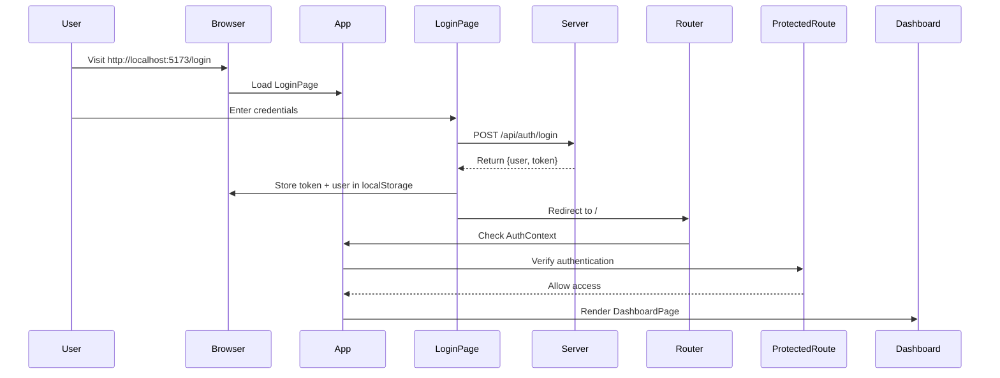

# Login System Documentation

## Overview

A complete authentication system has been implemented with a login page, protected routes, and user context management.

## Features

✅ **Login Page** - Beautiful, responsive login interface with test account buttons
✅ **JWT Authentication** - Token-based authentication with localStorage persistence
✅ **Protected Routes** - Routes automatically redirect to login if not authenticated
✅ **User Context** - Global auth state with `useAuth()` hook
✅ **Logout** - User menu with sign out functionality
✅ **Auto-login** - Persists login on page refresh if token exists

## File Structure

```
client/src/
├── pages/
│   └── LoginPage.tsx           # Login page component
├── contexts/
│   ├── AuthContext.tsx         # Auth state provider and hook
│   └── ProtectedRoute.tsx       # Protected route wrapper
├── config/
│   └── api.ts                  # API endpoints configuration
└── components/Layout/
    └── TopNavBar.tsx           # Updated with user menu
```

## Test Credentials

All credentials are available from the login page quick-login buttons:

| Email | Password | Role |
|-------|----------|------|
| elena@lucidflow.com | Elena2024@ | ADMIN |
| marcus@lucidflow.com | Marcus2024@ | MANAGER |
| sarah@lucidflow.com | Sarah2024@ | MEMBER |
| david@lucidflow.com | David2024@ | MEMBER |
| amina@lucidflow.com | Amina2024@ | MEMBER |

## How to Use

### 1. Basic Login Flow

```typescript
// User navigates to http://localhost:5173/login
// Enters credentials and clicks "Sign In"
// Token is stored in localStorage
// Redirected to dashboard at http://localhost:5173/
```

### 2. Using Auth in Components

```typescript
import { useAuth } from '../contexts/AuthContext';

export function MyComponent() {
  const { user, token, isAuthenticated, logout } = useAuth();

  return (
    <div>
      <p>Welcome, {user?.name}</p>
      <p>Email: {user?.email}</p>
      <p>Role: {user?.role}</p>
    </div>
  );
}
```

### 3. Making Authenticated API Requests

```typescript
import { getAuthHeader } from '../config/api';

const response = await fetch('http://localhost:3000/api/some-endpoint', {
  headers: getAuthHeader(),
});
```

### 4. Protecting Routes

Routes are automatically protected. Unauthenticated users are redirected to `/login`:

```typescript
// All routes inside ProtectedRoute are guarded
<Route
  element={
    <ProtectedRoute>
      <AppLayout />
    </ProtectedRoute>
  }
>
  <Route index element={<DashboardPage />} />
  {/* ... other routes */}
</Route>
```

## Configuration

### API URL

Set the API base URL in `client/.env.local`:

```env
VITE_API_BASE_URL=http://localhost:3000
VITE_ENV=development
```

If not set, defaults to `http://localhost:3000`.

## Component Details

### LoginPage.tsx

**Features:**
- Email and password input fields
- Error messages with user feedback
- Loading state during login
- Quick-login buttons for test accounts
- Beautiful gradient background with card design
- Responsive for mobile and desktop

**Props:** None (uses navigation and context)

**Returns:** Full-page login form

### AuthContext.tsx

**Provides:**
- `user` - Current user object or null
- `token` - JWT token or null
- `isAuthenticated` - Boolean flag
- `isLoading` - Loading state on mount
- `logout()` - Function to clear auth

**Usage:**
```typescript
const { user, token, isAuthenticated, isLoading, logout } = useAuth();
```

### ProtectedRoute.tsx

**Purpose:** Wraps routes that require authentication

**Behavior:**
- Shows loading indicator while checking auth status
- Redirects to `/login` if not authenticated
- Renders children if authenticated

**Usage:**
```typescript
<Route
  element={
    <ProtectedRoute>
      <ProtectedComponent />
    </ProtectedRoute>
  }
/>
```

### TopNavBar Updates

**New Features:**
- Shows current user's name and email
- User avatar from auth context
- Dropdown user menu
- Sign Out button with logout functionality
- Closes menu when clicking outside (currently manual, can enhance)

## Authentication Flow



## Security Considerations

✅ **Token Storage:** JWT stored in localStorage (accessible to XSS attacks - consider httpOnly cookies in production)
✅ **Token Headers:** Included in Authorization header for API requests
✅ **Protected Routes:** Client-side route protection (server-side validation also required)
✅ **Refresh Logic:** None implemented yet (tokens valid for 7 days)
✅ **CORS:** Configured server-side for localhost:5173

## Future Enhancements

- [ ] Token refresh mechanism (refresh tokens)
- [ ] HTTP-only secure cookies instead of localStorage
- [ ] Multi-factor authentication (MFA)
- [ ] Password reset flow
- [ ] "Remember me" functionality
- [ ] Session timeout warning
- [ ] User role-based route protection
- [ ] OAuth/Social login integration

## Troubleshooting

### Login button shows error
- Verify backend server is running on port 3000
- Check that API_ENDPOINTS.LOGIN points to correct URL
- Check browser console for CORS errors

### Auto-login not working
- Check localStorage for 'token' key
- Verify token hasn't expired (7-day expiration)
- Check browser console for errors in AuthContext

### Routes showing login page after login
- Clear localStorage and try again
- Check React DevTools to verify AuthContext state
- Verify useAuth() hook is being called

### User menu dropdown not closing
- Click outside the dropdown or on a different button
- Enhancement: Can add onClick handler to document to close menu

## Files Modified

- **new:** `client/src/pages/LoginPage.tsx`
- **new:** `client/src/contexts/AuthContext.tsx`
- **new:** `client/src/contexts/ProtectedRoute.tsx`
- **new:** `client/src/config/api.ts`
- **modified:** `client/src/App.tsx`
- **modified:** `client/src/components/Layout/TopNavBar.tsx`

## Backend Requirements

Ensure the backend server is running with the auth endpoints:

```bash
cd server
node index.js
# or with npm dev script (if configured)
npm run dev
```

Required endpoints:
- `POST /api/auth/login` - Accept {email, password}, return {user, token}
- `GET /api/auth/me` - Return current user (with Authorization header)
- `POST /api/auth/logout` - Clear session (optional, mainly front-end)

---

**Status**: Complete and ready to use! Login to test with any of the 5 development accounts.
